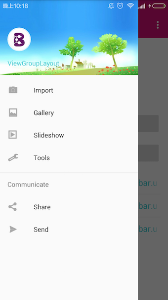

## ColorStatusBar

Android 4.4以上实现Material Design风格的状态栏（包括变色状态栏，NavigationView沿伸至状态栏）

## Include
- `maven`

``` xml
<dependency>
  <groupId>com.bobomee.android</groupId>
  <artifactId>colorstatus</artifactId>
  <version>1.0</version>
  <type>aar</type>
</dependency>
```

- `gradle`

``` java
compile 'com.bobomee.android:colorstatus:1.0@aar'
```

## ScreenShot

- Immersive




- Un-Immersive 


- Translucent 


- Full-Screen


## Usage

###1. 在布局文件中不要使用任何`android:fitsSystemWindows`属性

###2. 在`Activity`中

``` java
 @Override
    protected void onCreate(Bundle savedInstanceState) {
        super.onCreate(savedInstanceState);
        setContentView(R.layout.activity_view_group);
        StatusBarUtils.instance(this).setColor(color).
                setStyle(isFill ? StatusBarUtils.TYPE.FILL : StatusBarUtils.TYPE.NOMAL).init();
    }
```

###3. 关于样式

- `StatusBarUtils.TYPE.NOMAL(default)` : `StatusBar`覆盖在布局最外层
- `StatusBarUtils.TYPE.FILL` : `NavigationView` 和 `Content` 沿伸到 `StatusBar` 内部


